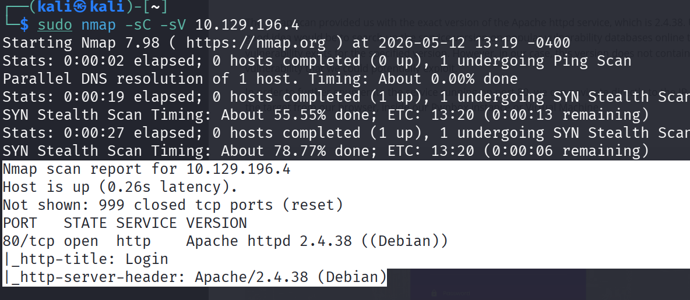
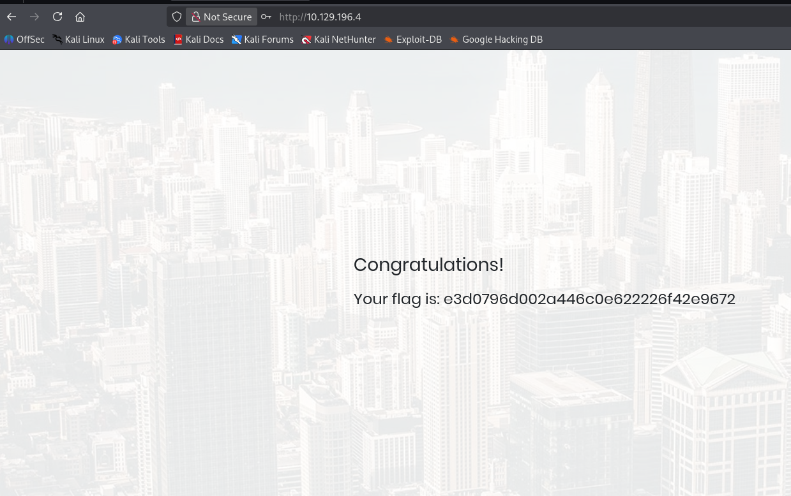

# Overview
Appointment is a beginner-friendly Linux machine on Hack The Box that focuses on basic web application testing and SQL Injection authentication bypass.

The machine started with a simple Nmap scan to identify open ports and running services:

```bash
nmap -sC -sV <IP>
```

The scan revealed that port `80` was open and hosting a web application to be exact Apache server. 



After visiting the target in the browser, a login page was discovered asking for a username and password. Since no valid credentials were available, the next step was to test the login form for common SQL Injection vulnerabilities.

A basic SQL Injection payload was entered into the username field:

```sql
admin'#
```

Any random value could be used as the password because the SQL query logic becomes true after injection.

The payload successfully bypassed the authentication mechanism and granted access to the web application dashboard.



After logging in, the flag was displayed inside the application and was successfully captured.

This machine demonstrates one of the most common web vulnerabilities, SQL Injection, where unsanitized user input is directly processed by backend SQL queries. Improper input validation allows attackers to manipulate database queries and bypass authentication systems.

---

## Key Learnings

- Performing basic web reconnaissance with Nmap
- Enumerating web applications running on port 80
- Identifying vulnerable login forms
- Understanding SQL Injection authentication bypass
- Using simple SQL Injection payloads
- Understanding insecure backend query handling
- Recognizing risks caused by poor input validation

---

## Skills Practiced

- Web Application Enumeration
- SQL Injection Testing
- Authentication Bypass Techniques
- Basic Web Exploitation
- Input Validation Analysis
- Linux Target Reconnaissance
- Beginner Penetration Testing Methodology

