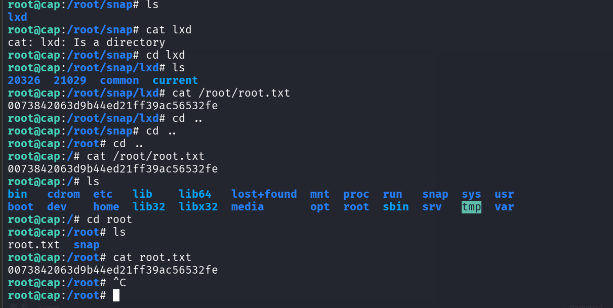

## Overview

Cap is an easy Linux machine on Hack The Box focused on network analysis, enumeration, and Linux privilege escalation through misconfigured capabilities.

The machine started with basic enumeration using Nmap, which revealed multiple open ports and a web application running on the target. During exploration of the web application, a downloadable PCAP file was discovered. The PCAP file was analyzed using Wireshark/tcpdump, where FTP traffic exposed plaintext credentials for the user `nathan`.

Using the discovered credentials, SSH access was obtained as the `nathan` user, allowing access to the user flag and further local enumeration on the machine.

During privilege escalation enumeration, Linux capabilities were checked using:

`getcap -r / 2>/dev/null`

It was discovered that Python had the `cap_setuid` capability enabled:

`/usr/bin/python3.8 = cap_setuid+ep`

This misconfiguration allowed privilege escalation to root by changing the effective user ID to 0 and spawning a root shell using Python.

Privilege Escalation Command:

`python3 -c 'import os; os.setuid(0); os.system("/bin/bash")'`

After gaining root access, the root flag was retrieved from `/root/root.txt`.

## Key Learnings

* Performing enumeration with Nmap
* Inspecting PCAP files for credential discovery
* Understanding Linux capabilities and `cap_setuid`
* Identifying privilege escalation vectors
* Exploiting Python capabilities for root access
* Using exposed plaintext credentials from network captures

## Skills Practiced

* Network Enumeration
* Packet Analysis
* Linux Privilege Escalation
* SSH Access & Enumeration
* Post Exploitation Enumeration
* Basic Web Enumeration

Cap is a great beginner-friendly machine for understanding how exposed network traffic and small Linux misconfigurations can lead to full system compromise.

