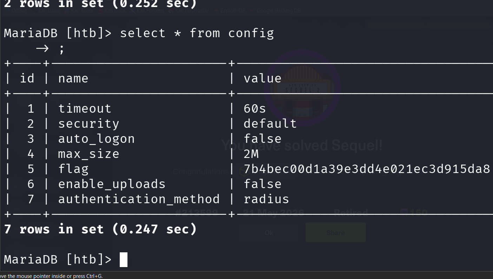

# Sequel — Hack The Box Walkthrough

Sequel is an easy Linux machine on Hack The Box that focuses on MySQL enumeration, database access misconfigurations, credential discovery, and basic Linux privilege exploration.

The machine started with an Nmap scan to identify open ports and running services:

```bash
nmap -sC -sV <IP>
```


The scan revealed an important service:

* Port `3306` running **MySQL**

Since MySQL was exposed publicly, the next step was to attempt direct authentication.

---

# MySQL Enumeration

A connection attempt was made using the default `root` user without providing a password:

```bash
mysql -h <TARGET-IP> -u root
```

The login was successful, confirming that the MySQL service allowed unauthenticated access.

After gaining access to the database server, the available databases were enumerated:


```sql
SHOW DATABASES;
```

Several databases were listed, including a database named `htb`.

The `htb` database was selected:

```sql
USE htb;
```

The available tables were then enumerated:

```sql
SHOW TABLES;
```

A table containing user information was identified.



---

# Credential Discovery

The contents of the table were dumped to identify stored credentials:

```sql
SELECT * FROM config;
```

The query revealed plaintext credentials stored inside the database.

The discovered credentials included a username and password that could potentially be reused on the target system.

---

---

# Key Learnings

* Performing service enumeration using Nmap
* Identifying exposed MySQL services
* Understanding database misconfigurations
* Enumerating MySQL databases and tables
* Extracting stored credentials from databases
* Reusing credentials for SSH access
* Basic Linux enumeration techniques

---

# Skills Practiced

* Linux Enumeration
* MySQL Enumeration
* Database Exploration
* Credential Discovery
* SSH Access
* Command-Line Navigation
* Information Gathering
* Post Authentication Enumeration

---